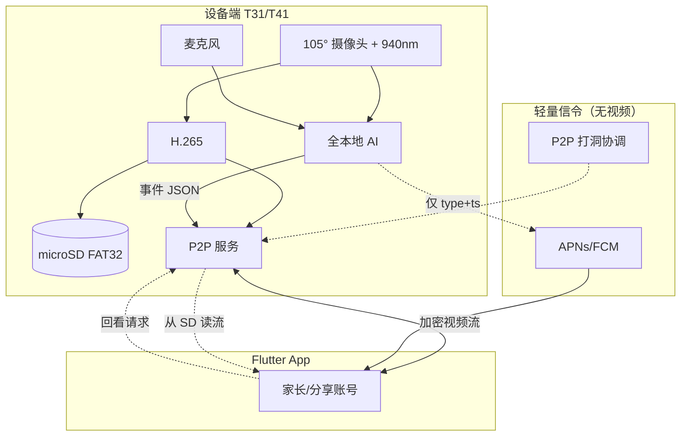

# 系统架构总览与里程碑

> v0.2 · **对齐海马爸比** · 全本地 · 零云存

## 1. 端到端数据流

**与海马爸比一致**：视频 **设备 → 手机 P2P** 或 **设备 → SD**；云端不参与媒体路径。

---

## 2. 关键设计决策（v0.2）

| 决策 | 选择 | 对标 |
|------|------|------|
| SoC | 君正 T31 / **T41** | 海马爸比 T31X / T41 |
| 隐私 | **零云存 + 硬件禁止上传** | 三大隐私屏障 |
| AI | 遮脸+趴睡+呼吸+哭声+围栏 | 二代全功能 |
| 连接 | P2P + 推送信令 | 私有 App，不经云看视频 |
| 原型 | **iPhone 12** 验证 AI/App | 竞品无，我方加速手段 |
| Pro | 云台人形追踪 + 4K | Pro 版 |

---

## 3. 功能对齐矩阵

| 功能 | 海马爸比 | 我们 v0.2 |
|------|----------|-----------|
| 940nm 夜视 | ✅ | ✅ |
| 哭声 ≥95% | ✅ | ✅ 目标 |
| 智能安抚 | ✅ | ✅ |
| 遮脸 | ✅ | ✅ |
| 趴睡/侧角 | ✅ | ✅ 新增 P0 |
| 虚拟围栏 | ✅ | ✅ |
| 呼吸/睡眠报告 | ✅ | ✅ 新增 P0 |
| 温湿度 | ✅ | ✅ 新增 P0 |
| 三看护模式 | ✅ | ✅ |
| 画面打码 | ✅ | ✅ |
| 1+5 账号 | ✅ | ✅ |
| 7×24 SD 回看 | ✅ | ✅ |
| 云台追踪 | Pro | Pro SKU |
| 精彩瞬间 | ✅ | Pro SKU |
| 云存 | ❌ 刻意不做 | ❌ 不做 |

---

## 4. 里程碑

### Phase 0 — 设计对齐 ✅

- [x] PRD/HW/SW/AI v0.2 对齐海马爸比
- [ ] 确认双 SKU 与售价

### Phase 1 — iPhone 12 原型（4 周）

| 交付 | 内容 |
|------|------|
| P1.1 | Swift App：预览 + 三模式 UI |
| P1.2 | Core ML：哭声 + 遮脸 + 趴睡 |
| P1.3 | 呼吸/睡眠报告 v0 |
| P1.4 | 智能安抚 + 本地事件时间线 |
| P1.5 | LAN 第二台手机预览（P2P） |

**退出标准**：上述 AI 场景各 20 条测试通过；UI 功能清单与 PRD MVP 一致。

### Phase 2 — T41 工程样机（8 周）

| 交付 | 内容 |
|------|------|
| P2.1 | T41 bring-up：1080p/4K + 940nm |
| P2.2 | MAGIK 模型移植 |
| P2.3 | SD FAT32 循环录 + P2P 回看 |
| P2.4 | 温湿度 + BLE 配网 |
| P2.5 | Pro 云台 + 人形追踪 |

### Phase 3 — Beta（8 周）

- 1+5 账号、打码、睡眠报告 polish
- 20 家庭内测，指标对齐海马爸比宣传口径
- SRRC + RoHS

### Phase 4 — 量产（12 周）

- 基础版 + Pro 双 SKU
- 目标零售价 ¥399–799

---

## 5. 文档索引

| 文档 | 路径 |
|------|------|
| 产品需求 v0.2 | [PRD.md](./PRD.md) |
| 硬件（T31/T41） | [HARDWARE.md](./HARDWARE.md) |
| 软件（零云存） | [SOFTWARE.md](./SOFTWARE.md) |
| AI（趴睡/呼吸） | [AI.md](./AI.md) |

---

## 6. 建议下一步

**优先用 iPhone 12 启动 Phase 1**，最快对齐海马爸比的功能体验；T41 硬件并行采购。

确认后可开始：`ios-prototype/` Swift 项目 + 第一个 Core ML 哭声模型 demo。
