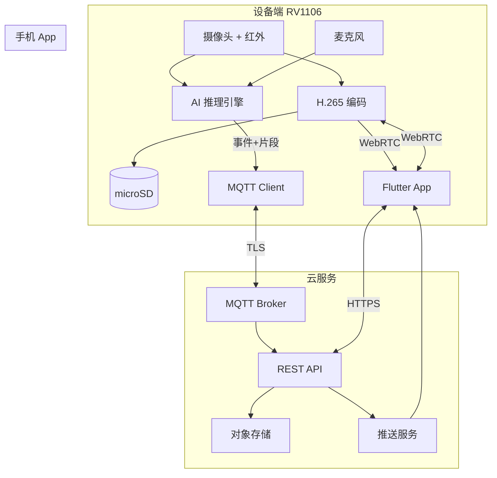

# 系统架构总览与里程碑

> AI 婴儿看护摄像头 · 端到端架构 · v0.1

## 1. 端到端数据流

## 2. 关键设计决策

| 决策 | 选择 | 原因 |
|------|------|------|
| 算力位置 | 边缘 NPU 为主 | 低延迟、隐私、带宽 |
| 视频协议 | WebRTC 实时 + H.265 录像 | 延迟与存储效率平衡 |
| 告警通道 | MQTT 事件 + 移动推送 | IoT 标准，易扩展 |
| 开发路径 | 树莓派原型 → RV1106 量产 | 降低前期硬件风险 |
| App 跨平台 | Flutter | 团队效率、UI 一致 |

## 3. 里程碑计划

### Phase 0 — 设计确认（当前，1 周）

- [x] PRD / 硬件 / 软件 / AI 文档
- [ ] 确认 TBD 项（售价、雷达、云平台）
- [ ] 采购树莓派原型硬件

### Phase 1 — 原型验证（4–6 周）

| 交付 | 内容 |
|------|------|
| P1.1 | 树莓派 RTSP 推流 + Flutter 预览 |
| P1.2 | 哭声检测 demo（Python，CPU） |
| P1.3 | 遮脸检测 demo（OpenCV + 简单 CNN） |
| P1.4 | Docker 本地云（MQTT + API + MinIO） |
| P1.5 | App 配网 + 事件时间线 MVP |

**退出标准**：局域网全链路跑通，哭声/遮脸各 20 条场景测试通过。

### Phase 2 — 工程样机（6–8 周）

| 交付 | 内容 |
|------|------|
| P2.1 | RV1106 模组 bring-up（视频 + WiFi） |
| P2.2 | RKNN 模型移植（detector + face_cover + cry） |
| P2.3 | 设备端 C++ 服务框架 |
| P2.4 | BLE 配网 + MQTT 上云 |
| P2.5 | 结构手板 + 940nm 夜视调校 |

**退出标准**：样机 72h 稳定运行，告警延迟 < 3s。

### Phase 3 — Beta（8 周）

- OTA、多用户、SD 循环录像
- 20 个家庭内测 + 误报率统计
- SRRC 预测试

### Phase 4 — 量产（12 周）

- EVT → DVT → PVT
- 认证、产测工具、包装
- 上市

## 4. 团队分工建议

| 角色 | 人数 | 职责 |
|------|------|------|
| 嵌入式 | 1–2 | firmware、驱动、RV1106 |
| AI 算法 | 1 | 模型训练、RKNN、评测 |
| 后端 | 1 | API、MQTT、推送 |
| 移动端 | 1 | Flutter App |
| 硬件 | 1 | 原理图、结构、认证 |
| 产品/测试 | 0.5 | 场景验收、内测 |

最小可行团队：**4–5 人**，Phase 1 可由 2 人（全栈 + AI）启动。

## 5. 风险与对策

| 风险 | 影响 | 对策 |
|------|------|------|
| 遮脸误报高 | 用户卸载 | 连续帧确认 + 用户反馈闭环 |
| 夜视 ISP 差 | AI 准确率降 | IMX415 备选；红外补光调校 |
| WebRTC 公网穿透失败 | 远程看不了 | TURN 中继；子码流降码率 |
| RV1106 SDK 坑 | 延期 | 原型轨并行；预留 2 周 buffer |
| 隐私合规 | 法律风险 | 默认本地；明确隐私政策 |

## 6. 文档索引

| 文档 | 路径 |
|------|------|
| 产品需求 | [PRD.md](./PRD.md) |
| 硬件选型 | [HARDWARE.md](./HARDWARE.md) |
| 软件架构 | [SOFTWARE.md](./SOFTWARE.md) |
| AI 管线 | [AI.md](./AI.md) |

## 7. 下一步行动

1. **确认 PRD 中 5 个 TBD**（见 PRD §8）
2. **采购原型硬件**（树莓派 5 + Camera Module 3）
3. **启动 Phase 1 代码骨架**（`prototype/` + `backend/` + `app/`）

确认设计后，我可以直接开始 Phase 1 的代码实现（树莓派推流 + 本地 MQTT + Flutter 预览）。
